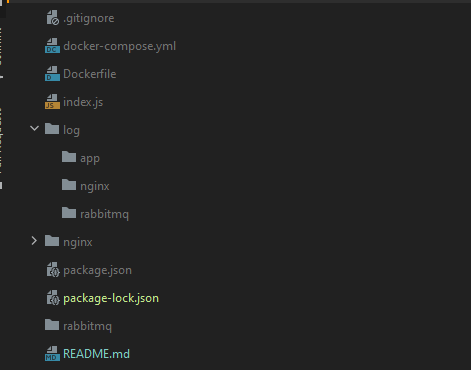

# ✨nginx_node_redis_rabit
## How to install
- create folder 
  - log/app
  - log/nginx
  - log/rabbitmq
  - rabbitmq  
 - run: docker-compose up
 - references:
     - https://geshan.com.np/blog/2021/07/rabbitmq-docker-nodejs/
     - https://ashwin9798.medium.com/nginx-with-docker-and-node-js-a-beginners-guide-434fe1216b6b
     - https://progressivecoder.com/docker-compose-nodejs-application-with-redis-integration/
  

    